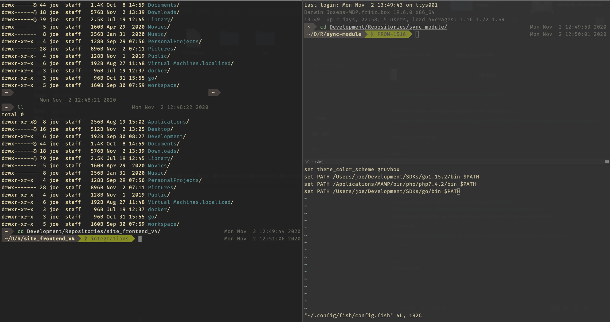

# Shell Configs

This repo contains my favourite shell configurations, made from scratch, thoughtful choices.

My currently favourite shell is `fish`. In order to set it up follow the below instructions:

- Download the installer `.pkg` file for macOS from [official site](https://fishshell.com) or whatever instructions are necessary for your chosen Operating System.
- Change your default shell in macOS to `fish` with `chsh -s /usr/local/bin/fish`.
- Install Oh My Fish with `curl -L https://get.oh-my.fish | fish`
- Download `Fira Code Nerd` font from [nerdfonts](https://www.nerdfonts.com/font-downloads).
- Install the fonts to your macOS system by dragging them to the Font Book app.
- Run `fish_config` to open the web based configuration for fish shell and select the Base16 Eighties color scheme.
- Install the iTerm2 color scheme Gruvbox with the provided file in the fish folder of this repo.
- Symlink the `config.fish` file of this repo to the respective system folder with: 
`ln -s {Cloned Repo Location}/fish/config.fish {Home Folder}/.config/fish/config.fish`
- Quit any iTerm instances and re-start the shell

You should have a beautiful shell by now:
